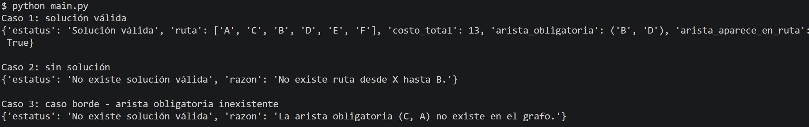

# banamex-graph-route-optimization
Optimización de rutas en grafos con restricción de arista obligatoria, incluyendo generación de datos sintéticos y validación de escenarios.

## Descripción del problema

Este proyecto resuelve un problema de optimización de rutas en un grafo dirigido ponderado.

El objetivo es encontrar la ruta de menor costo entre un nodo origen y un nodo destino, incluyendo obligatoriamente una arista específica (u, v).

## Caso de negocio

Este problema puede aplicarse a escenarios como redes de transferencias financieras, donde:

 - Los nodos representan entidades (clientes, bancos, sistemas)
 - Las aristas representan conexiones o transacciones posibles
 - Los costos representan comisiones, tiempo o riesgo
 - La arista obligatoria representa una restricción (ej. pasar por una cámara de compensación)

## Enfoque de solución

El problema se resolvió dividiéndolo en tres partes:

 - Encontrar la ruta más corta desde el origen → nodo_u
 - Incluir la arista obligatoria (nodo_u → nodo_v)
 - Encontrar la ruta más corta desde nodo_v → destino

Para calcular rutas mínimas se utilizó el algoritmo de Dijkstra, adecuado para grafos con pesos positivos.

## Estructura del grafo

El grafo se representa como un diccionario en Python:

grafo = {

    "A": [("B", 4), ("C", 2)],
    "B": [("D", 5)],
    "C": [("B", 1), ("D", 8)],
    "D": [("E", 2)],
    "E": [("F", 3)],
    "F": []
    
}

Cada nodo contiene una lista de conexiones con su costo.

## Generación de datos

El dataset es sintético y se genera mediante la función:

grafo = generar_grafo()

## Justificación del dataset

El dataset fue diseñado para validar distintos escenarios:

Múltiples rutas posibles → valida que el algoritmo optimiza correctamente
Nodos desconectados → valida casos sin solución
Aristas inexistentes → valida casos borde

## Cómo ejecutar el proyecto

1. Requisitos
 - Python 3.x
 - No se requieren librerías externas

2. Ejecutar el script

Desde la terminal:

python main.py

3. Qué hace el script

El archivo main.py ejecuta automáticamente tres escenarios de prueba:
 - Caso válido
 - Caso sin solución
 - Caso borde

Y muestra los resultados la terminal.

## Entradas de la función principal:

ruta_minima_con_arista_obligatoria(grafo, origen, destino, nodo_u, nodo_v)

 - origen: nodo inicial
 - destino: nodo final
 - (nodo_u, nodo_v): arista obligatoria

## Salidas

La función devuelve un diccionario con:
{

    "estatus": str,
    "ruta": list,
    "costo_total": int,
    "arista_obligatoria": tuple,
    "arista_aparece_en_ruta": bool
    
}

## Escenarios de prueba incluidos:

Caso 1: Solución válida

Entrada:
 - Origen: A
 - Destino: F
 - Arista obligatoria: B → D

Salida:
 - Ruta: A → C → B → D → E → F
 - Costo total: 13
 - Arista incluida: True

Caso 2: Sin solución

Entrada:
 - Origen: X
 - Destino: F
 - Arista obligatoria: B → D

Salida:
 - No existe solución válida

Caso 3: Caso borde

Entrada:
 - Origen: A
 - Destino: F
 - Arista obligatoria: C → A

Salida:
 - No existe solución válida

## Validación de la arista obligatoria:

Se implementa una función que verifica explícitamente que la arista (u, v) aparece en la ruta final:

validar_arista_obligatoria(ruta, nodo_u, nodo_v)

## Preguntas clave que responde esta solución:

¿Cómo mapea el problema a negocio?
→ Modela redes de transferencia o logística con restricciones.

¿Por qué el dataset es suficiente?
→ Incluye escenarios válido, sin solución y borde.

¿Cómo se valida la arista obligatoria?
→ Se revisa explícitamente en la ruta final.

¿Qué pasa si no hay solución?
→ Se devuelve un mensaje claro con la razón.

¿Qué parte es más frágil?
→ Dependencia en la correcta definición del grafo.

¿Qué se mejoraría?
→ Soporte para múltiples restricciones y mejor performance.

## Reproducibilidad:
Este proyecto es completamente reproducible ejecutando:

python main.py

El dataset se genera automaticamente dentro del código.

A continuación se muestra un ejemplo de la salida al ejecutar el script:

